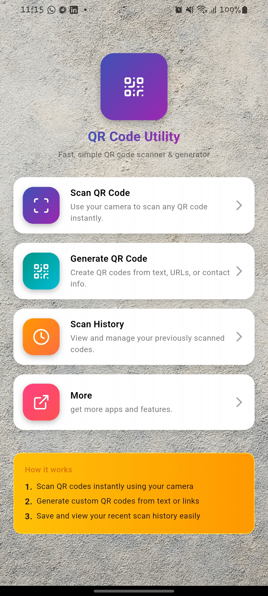
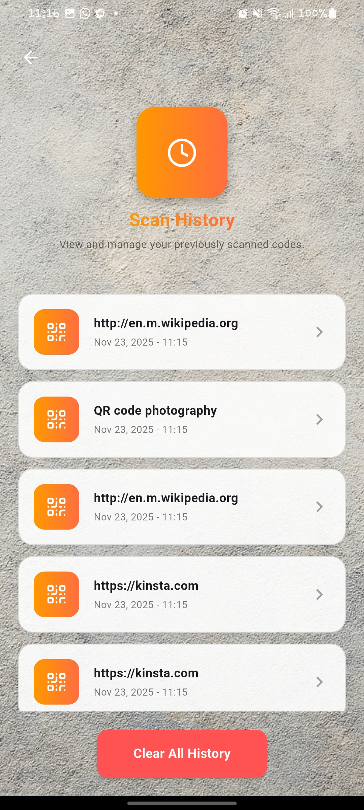
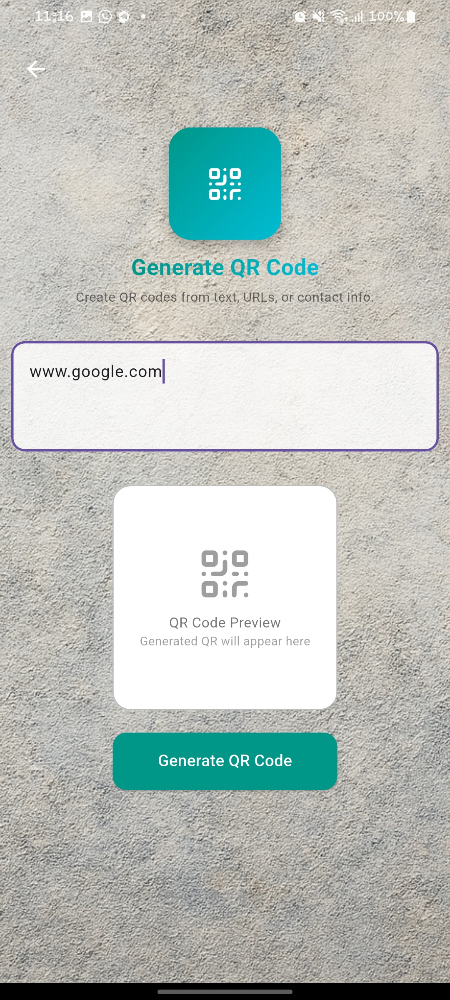
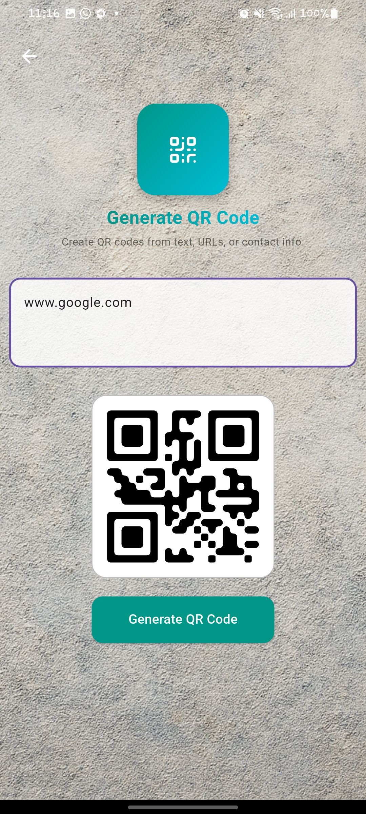
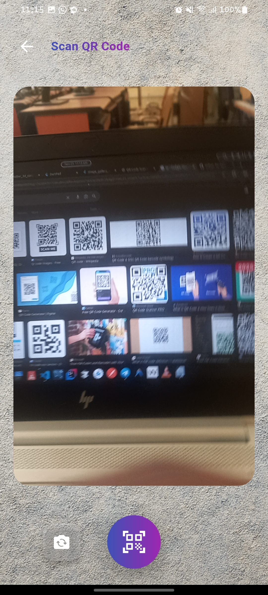
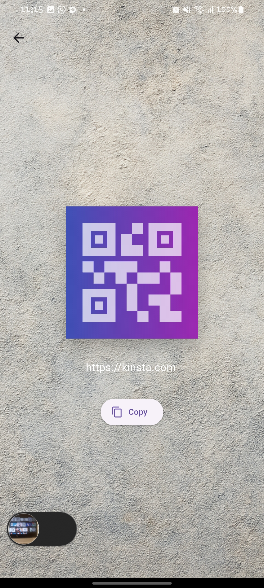
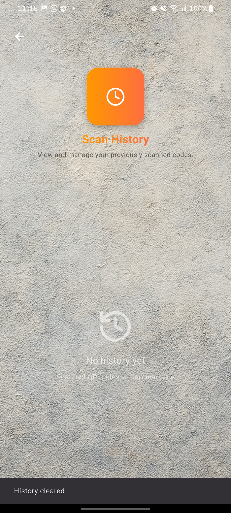

# 🔍 QR Code Scanner

A sleek and lightning-fast **QR Code Scanner App** built with **Flutter** — scan, decode, and share instantly!

## 📷 Screenshots

|  |  |  |  |
|-------------------------------------------|-------------------------------------------|-------------------------------------------|-------------------------------------------|
|  |  |  | 

---

## ✨ Features
- 📱 **Instant Scan** – Reads QR codes in seconds  
- 🖼️ **Camera & Gallery Support**  
- 💾 **Scan History** – Keeps track of past scans  
- 🌙 **Clean UI with Dark/Light Mode**

---

## 🚀 Tech Stack
- Flutter  
- Dart  

---

> 🎯 *Simple. Fast. Reliable.*  
